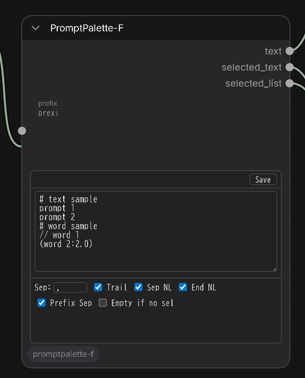
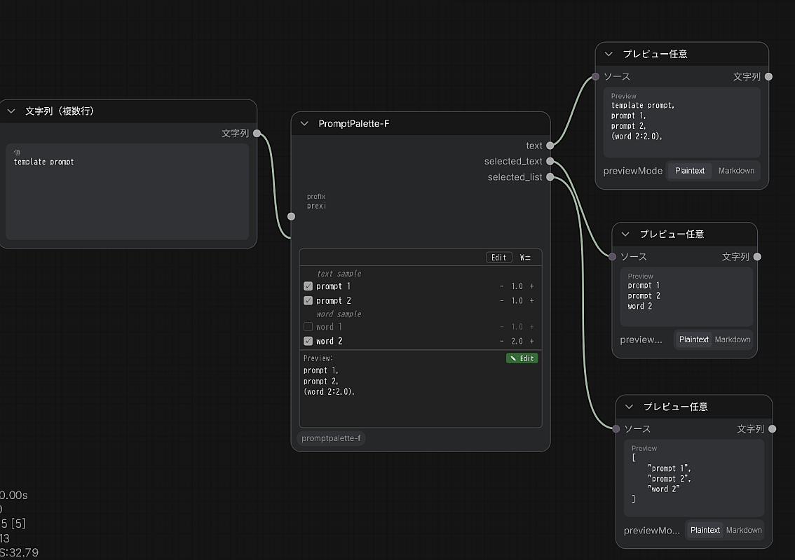
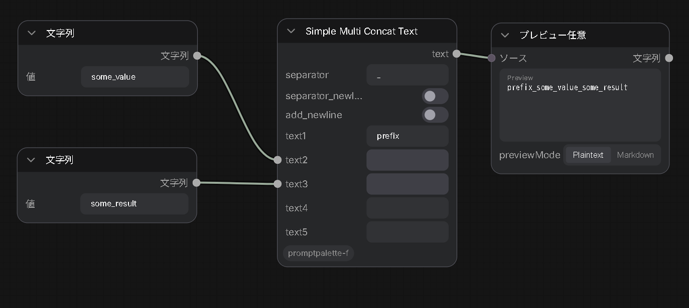
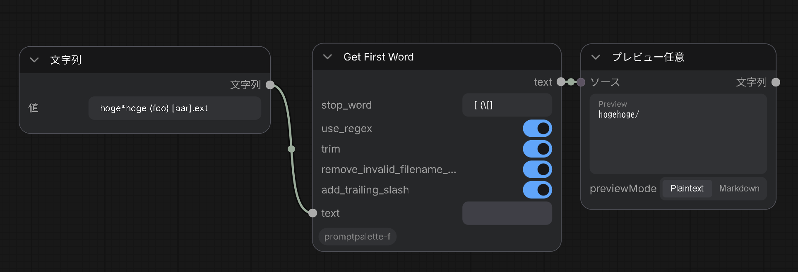
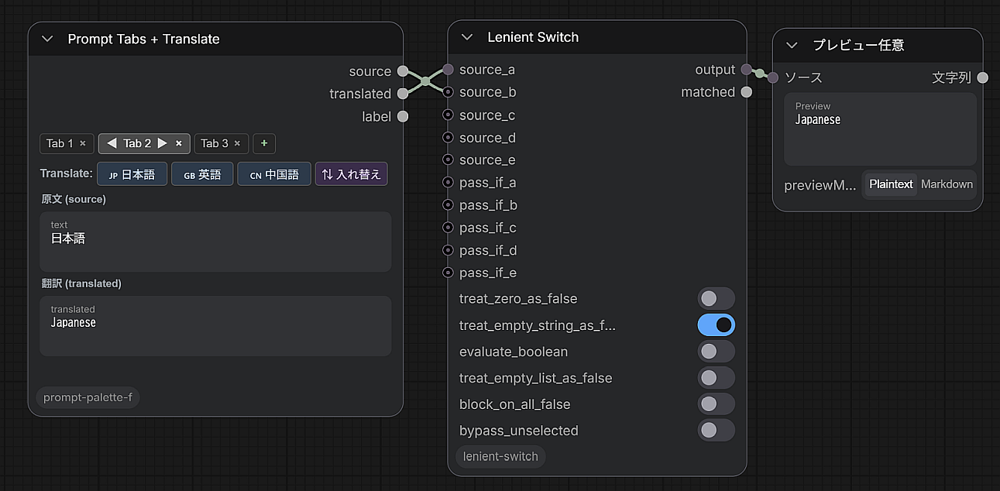
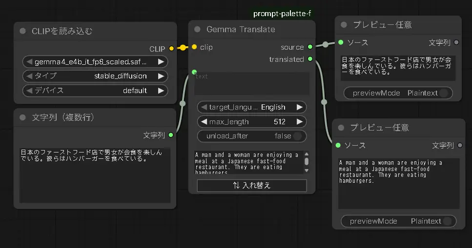
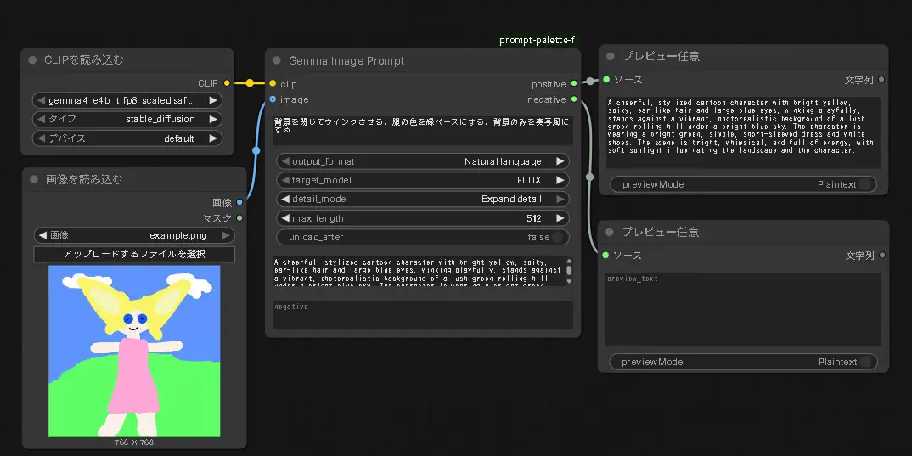
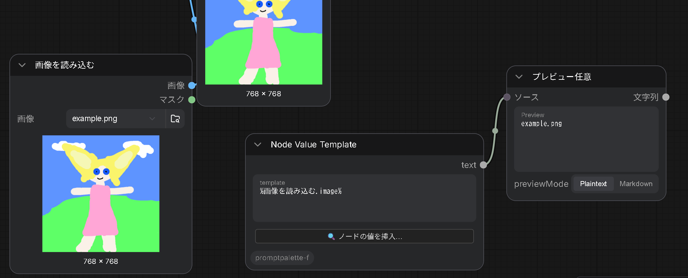
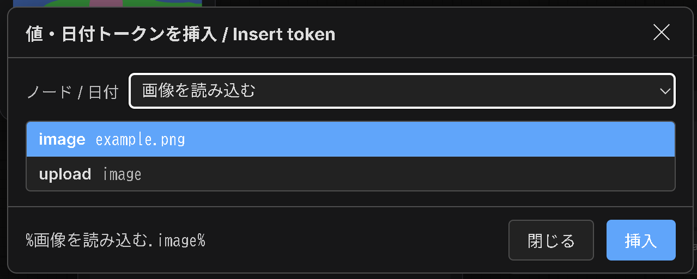

# ComfyUI PromptPalette-F

## (共通)インストール

1. ComfyUIの `custom_nodes` ディレクトリにクローン

```bash
cd ComfyUI/custom_nodes
git clone https://github.com/id-fa/ComfyUI-PromptPalette-F prompt-palette-f
cd prompt-palette-f
pip install -r requirements.txt
```

2. ComfyUIを再起動

もしくはComfyUI Managerからインストール（※少し古いバージョンになることがあります）

# PromptPalette-F

トリガーワードやフレーズのメモを取りつつトグルでオン・オフを切り替えできるComfyUI用カスタムノード





## 機能

- **フレーズの切り替え** - チェックボックスでのON/OFF切り替え
- **フレーズの重み調整** - +/-ボタンでの重み調整 （※最初の単語のみ）
- **グループ一括制御** - `[グループ名]` タグでフレーズをグループ化して一括制御
- **カスタム区切り文字** - 結合するための区切り文字設定（デフォルト：カンマ+スペース）
- **出力** - カスタム区切り文字で連結されたテキスト

## 使い方

1. **ノードを追加**: `PromptPalette-F` ノードをワークフローに追加
2. **テキスト編集**:
   - **Edit**ボタンをクリックして編集モードに切り替え
   - 1行に1つのフレーズを入力
   - **Save**ボタンをクリックして編集を完了
3. **フレーズ制御**:
   - 表示モードで**チェックボックス**を切り替えてフレーズを有効/無効化
   - **+/-ボタン**でフレーズの重みを調整
   - **グループボタン**でグループ全体を一括制御
4. **カスタム区切り文字の設定**（オプション）:
   - separatorフィールドでフレーズを結合する区切り文字を設定（デフォルト：`, `）
   - 区切り文字なし/間隔なしの場合は空文字列を使用
5. **説明コメントの追加**（オプション）:
   - `#` で始まる行を追加して説明コメントを記述
   - コメントは次のフレーズの上に説明テキストとして表示
6. **出力**:
   - 選択されたフレーズが設定された区切り文字で出力される

## 高度な使い方

### コメントの種類

- **切り替えコメント（`//`）**: `//` で始まる行はチェックボックスがOFFの状態がデフォルトになる
- **説明コメント（`#`）**: `#` で始まる行は次のフレーズの上に説明テキストとして表示

### グループ機能

- **基本的な使い方**: 行の末尾に `[グループ名]` を追加してグループを作成
- **複数グループ**: 1つのフレーズに複数のグループタグを設定可能（例：`[nature][style1]`）
- **グループ制御**: ノード上部に表示されるグループボタンで一括制御
- **エスケープ**: 実際の角括弧を出力したい場合は `\[` と `\]` でエスケープ

#### グループ使用例:
```
beautiful landscape [nature-warm1]
sunset colors [nature-warm2]
// character design [char1]
anime girl [char1][char2]
high quality
model \[v2.1\] settings [model21]
```

### 設定項目

Nodes 2.0モードでは編集モード時の設定行に省略表示されます。括弧内が省略名。

- **text** - メインの入力テキスト（1行に1フレーズ）
- **prefix** - テキストの前に置く文字列（複数ノード連結用）
- **separator** （`Sep`） - フレーズを結合する際の区切り文字（デフォルト：`, `）
- **trailing_separator** （`Trail`） - 最後のフレーズの後にも区切り文字を追加
- **separator_newline** （`Sep NL`） - 各区切り文字の後に改行を追加
- **add_newline** （`End NL`） - 最終出力の末尾に改行を追加
- **prefix_separator** （`Prefix Sep`） - prefix と本文の間に separator を挿入する（デフォルトOFF。OFFなら `prefix + 本文` がそのまま連結される）
- **empty_when_no_selection** （`Empty if no sel`） - 選択されているフレーズが1つもない時に、出力(text / selected_text / selected_list)をすべて Python `None` にする。prefix も改行も出力されない。下流で [rgthree Any Switch](https://github.com/rgthree/rgthree-comfy) などの `value is None` を判定するスイッチに繋いで、選択ゼロ時に別の入力へルーティングする用途を想定（デフォルトOFF）

# Simple Multi Concat Text

- カテゴリ: `PromptPalette-F`
- 表示名: `Simple Multi Concat Text`
- クラス: `SimpleMultiConcatText`

最大5つのテキスト入力を区切り文字で連結するUIなしのユーティリティノードです。



入力:

| 入力 | 型 | 説明 |
| --- | --- | --- |
| `text1`〜`text5` | STRING | 連結するテキスト（すべて接続専用のスロット。未接続・空・None の入力は自動的に除外されるので `a,,b` のような区切り文字の連続が発生しません） |
| `separator` | STRING | 連結時の区切り文字（デフォルト：`""`＝空文字） |
| `separator_newline` | BOOLEAN | ONで区切り文字の後に改行を追加。`separator=""` のときでも機能し、その場合は改行のみで行ごとに連結されます（デフォルトOFF） |
| `add_newline` | BOOLEAN | ONで出力末尾に改行を追加。有効な入力が1つもないときはスキップされます（デフォルトOFF） |

出力:

| 出力 | 型 | 意味 |
| --- | --- | --- |
| `text` | STRING | 有効な入力を区切り文字で連結したテキスト |

# Get First Word

- カテゴリ: `PromptPalette-F`
- 表示名: `Get First Word`
- クラス: `GetFirstWord`

入力テキストから、指定した区切り文字（ストップワード）が最初に現れる位置より前の部分を取り出すUIなしのユーティリティノードです。先頭の単語の抽出や、プロンプトからのファイル名・フォルダ名生成などに使えます。



入力:

| 入力 | 型 | 説明 |
| --- | --- | --- |
| `text` | STRING | 入力テキスト（接続専用スロット） |
| `stop_word` | STRING | この文字列が最初に現れる位置より前を出力（デフォルト：`,`）。リテラルモードでは `\n` `\r` `\t` のエスケープシーケンスが展開されるので、1行ウィジェットで改行・タブを指定できます |
| `use_regex` | BOOLEAN | ONで `stop_word` を正規表現として解釈。無効なパターンの場合はテキスト全体を返します（例外を投げません）。ONのときはエスケープ展開はスキップ（デフォルトOFF） |
| `trim` | BOOLEAN | 結果の前後の空白・改行を除去（デフォルトON） |
| `remove_invalid_filename_chars` | BOOLEAN | Windowsのファイル名で禁止されている文字（`<>:"/\|?*` と制御文字）と末尾のドット・スペースを除去（デフォルトOFF） |
| `add_trailing_slash` | BOOLEAN | フォルダパスとして使えるよう末尾に `/` を追加。結果が空のときはスキップ（デフォルトOFF） |

`stop_word` が空文字の場合はテキスト全体を返します。

出力:

| 出力 | 型 | 意味 |
| --- | --- | --- |
| `text` | STRING | ストップワードより前の部分 |

## Get First Word (List)

- カテゴリ: `PromptPalette-F`
- 表示名: `Get First Word (List)`
- クラス: `GetFirstWordList`

`Get First Word` の処理を LIST 入力の各要素に適用するUIなしのユーティリティノードです。`PromptPalette-F` の `selected_list` 出力などと組み合わせて使えます。

入力:

| 入力 | 型 | 説明 |
| --- | --- | --- |
| `items` | LIST | 処理対象のリスト（接続専用スロット） |
| `stop_word` / `use_regex` / `trim` / `remove_invalid_filename_chars` / `add_trailing_slash` | — | `Get First Word` と同じ設定（各要素に適用） |
| `text_separator` | STRING | `text` 出力で結果を連結する際の区切り文字（デフォルト：`, `）。`list` 出力には影響しません |

出力:

| 出力 | 型 | 意味 |
| --- | --- | --- |
| `text` | STRING | 各要素の処理結果を `text_separator` で連結したテキスト |
| `list` | LIST | 各要素の処理結果のリスト（生の結果。区切り文字の影響を受けません） |

# Prompt Tabs

- カテゴリ: `PromptPalette-F`
- 表示名: `Prompt Tabs`
- クラス: `PromptTabs`

名前付きのプロンプトタブを好きなだけ1つのノードに保持できるメモ帳スタイルのテキストノードです。現在アクティブなタブのテキストを出力します。タブを切り替えることで、別のプロンプトを削除せずに残しておけるので、試行錯誤しながら以前のプロンプトに戻りたいときに便利です。


| 操作 | 方法 |
| --- | --- |
| タブ切り替え | タブをクリック |
| タブ追加 | `+` をクリック（タブ数は無制限。複数行に折り返して表示されます） |
| タブの改名 | タブをダブルクリック |
| タブ削除 | タブの `×` をクリック（確認ダイアログあり。最低1つのタブは必ず残ります） |

出力:

| 出力 | 型 | 意味 |
| --- | --- | --- |
| `text` | STRING | アクティブなタブの内容 |
| `label` | STRING | アクティブなタブの名前（`Tab 1`、`Tab 2`、または改名した名前） |

# Prompt Tabs + Translate

- カテゴリ: `PromptPalette-F`
- 表示名: `Prompt Tabs + Translate`
- クラス: `PromptTabsTranslate`

`Prompt Tabs` の翻訳対応版です。各タブが **原文** と **翻訳文** の2つのフィールドを独立して保持し、どちらも自由に編集できます。`🇯🇵 日本語に翻訳` / `🇬🇧 英語に翻訳` / `🇨🇳 中国語に翻訳` の3ボタンで、原文をその言語へ翻訳して翻訳文フィールドに反映します。翻訳後の文章はそのまま手直しできます。

翻訳はボタンを押した時点でその場で実行されます（ワークフロー実行を待つ必要はありません）。翻訳には `googletrans` を利用するためAPIキーは不要です（`requirements.txt` に記載）。



| 操作 | 方法 |
| --- | --- |
| タブ切り替え | タブをクリック |
| タブ追加 | `+` をクリック |
| タブの改名 | タブをダブルクリック |
| タブ削除 | タブの `×` をクリック（確認ダイアログあり。最低1つのタブは必ず残ります） |
| 翻訳 | 翻訳先の言語ボタンをクリック（原文を翻訳して翻訳文フィールドへ） |

出力:

| 出力 | 型 | 意味 |
| --- | --- | --- |
| `source` | STRING | アクティブなタブの原文 |
| `translated` | STRING | アクティブなタブの翻訳文 |
| `label` | STRING | アクティブなタブの名前 |

# Gemma Translate（実験的ノード）

- カテゴリ: `PromptPalette-F`
- 表示名: `Gemma Translate`
- クラス: `GemmaTranslate`

> ⚠️ **実験的ノードです。** ComfyUIに最近追加されたGemma4テキストエンコーダの**テキスト生成（LLM）機能**を利用するため、**ComfyUI v0.21.0以降が必要**です。それより古いバージョンではノードは表示・登録されますが、実行すると翻訳できずエラー文字列を返します（他のノードには影響しません）。

`googletrans` を使う `Prompt Tabs + Translate` とは違い、こちらは**Gemma4のローカルLLMによる翻訳**を行います。`CLIPLoader` で読み込んだ Gemma4 モデルを `clip` 入力に接続し、ComfyUI標準の `TextGenerate` ノードと同じ生成処理（`clip.tokenize` → `clip.generate` → `clip.decode`）で翻訳します。外部サービスを使わずローカルで完結します。



モデルは `ComfyUI/models/text_encoders/` に配置します。

> ✅ **動作確認済みモデル**: `gemma4_e4b_it_fp8_scaled.safetensors`（現時点で動作確認が取れているモデルです）

> 📌 **実行のしかた**: このノードはモデルがワークフロー実行中にしか存在しないため、`Prompt Tabs + Translate` のような「ボタンで即時翻訳」はできません。**Queue Prompt（ワークフロー実行）時に翻訳が走り**、結果がノードの翻訳欄に表示されます。CLIP接続が必須なので単独実行はできません（翻訳専用ワークフローでの利用を想定）。

| 操作 | 方法 |
| --- | --- |
| 翻訳 | `target_language` を選んで **Queue Prompt**（実行後、翻訳欄に結果が反映されます） |
| 入れ替え | `⇅ 入れ替え` ボタンで元テキストと翻訳テキストを交換 |

入力:

| 入力 | 型 | 説明 |
| --- | --- | --- |
| `clip` | CLIP | `CLIPLoader` で読み込んだ Gemma4 エンコーダ（必須） |
| `text` | STRING | 翻訳する元テキスト |
| `target_language` | 選択 | 翻訳先の言語（`English` / `Japanese` / `Chinese`） |
| `max_length` | INT | 生成する最大トークン数（デフォルト：512） |
| `unload_after` | BOOLEAN | ONで翻訳後にモデルをVRAMからアンロード（`unload_all_models`）。翻訳専用ワークフロー向け。ComfyUIセッション全体のモデルキャッシュに影響します（デフォルトOFF） |

出力:

| 出力 | 型 | 意味 |
| --- | --- | --- |
| `source` | STRING | 入力した元テキスト |
| `translated` | STRING | 翻訳結果（コードフェンスや `Translation:` ラベル・引用符は除去されます） |

# Gemma Image Prompt（実験的ノード）

- カテゴリ: `PromptPalette-F`
- 表示名: `Gemma Image Prompt`
- クラス: `GemmaImagePrompt`

> ⚠️ **実験的ノードです。** `Gemma Translate` と同じく Gemma4 のテキスト生成機能を使うため **ComfyUI v0.21.0 以降が必要**です。さらに**画像認識（vision）対応の Gemma4 モデル**を使う必要があります。

入力画像をGemma4に「見せて」、それに似た画像を生成するための text-to-image プロンプトを出力するノードです。修正指示を受け付けて反映し、想定する生成モデルや出力形式に合わせてプロンプトを調整します。画像認識→生成は、`Gemma Translate` と同様に**ワークフロー実行（Queue Prompt）時**に走ります。

> 📌 **画像入力なしでも動作**します。その場合は「指示テキストのみ」から画像生成プロンプトを組み立てます（画像認識は行いません）。画像も指示も両方空の場合は空文字を出力します。
>
> ⚠️ **注意**: Gemma-4-E4B は指示への追従能力が限られるため、Danbooruタグ形式や `POSITIVE:` / `NEGATIVE:` 形式を完全に守らないことがあります（テスト用ノードです。崩れた場合もパーサが可能な範囲で復元します）。



入力:

| 入力 | 型 | 説明 |
| --- | --- | --- |
| `clip` | CLIP | `CLIPLoader` で読み込んだ vision対応 Gemma4 エンコーダ（必須） |
| `image` | IMAGE | 認識させる画像（任意）。接続すると「似た画像」を生成するプロンプトを作ります。未接続なら指示テキストのみで生成します |
| `instruction` | STRING | 内容修正指示（自由入力。例：`夜にして、雨を降らせる`）。画像認識の結果に上乗せして反映します |

設定:

| 設定 | 選択肢 | 説明 |
| --- | --- | --- |
| `output_format` | `Natural language` / `Danbooru tags` | 出力形式。自然言語の文章か、カンマ区切りのDanbooruタグ列挙か |
| `target_model` | `FLUX` / `SDXL` | 想定生成モデル。FLUX→自然言語寄りでネガティブは空。SDXL→ネガティブプロンプトも生成 |
| `detail_mode` | `Keep as instructed` / `Expand detail` | 指示以外は変更しない（オブジェクトを増やさない）か、情報量を拡張して要素を増やすか |
| `prompt_mode` | `Generate (recreate image)` / `Edit instruction (change description)` | 出力の種類。前者＝似た画像を生成するプロンプト。後者＝**画像編集モデル（Qwen Image Edit等）向け**に「赤い車を青い車に変える」のように**変更前→変更後を明示した編集指示**を出力（変更後の描写だけにしない）。編集モードでは自然言語で記述し、ネガティブは空になります |
| `max_length` | INT | 生成する最大トークン数（デフォルト：512） |
| `unload_after` | BOOLEAN | ONで実行後にモデルをVRAMからアンロード（デフォルトOFF） |

出力:

| 出力 | 型 | 意味 |
| --- | --- | --- |
| `positive` | STRING | ポジティブプロンプト |
| `negative` | STRING | ネガティブプロンプト（FLUX選択時や不要時は空になることがあります） |

> ✅ **動作確認済みモデル**: `gemma4_e4b_it_fp8_scaled.safetensors`

# Node Value Template

- カテゴリ: `PromptPalette-F`
- 表示名: `Node Value Template`
- クラス: `NodeValueTemplate`

ComfyUI標準の `Save Image` ノードの `filename_prefix`（`%KSampler.seed%` のような書式）と同じ要領で、他のノードのウィジェット値を `%ノードタイトル.ウィジェット名%` 形式で文字列に埋め込めるノードです。プロンプトやファイル名にseed・cfg・モデル名などを動的に差し込みたいときに使えます。



入力:

| 入力 | 型 | 説明 |
| --- | --- | --- |
| `template` | STRING | `%ノードタイトル.ウィジェット名%` トークンを含むテキスト。各トークンは、タイトルが一致するノードの該当ウィジェットの現在値に置き換えられます |

出力:

| 出力 | 型 | 意味 |
| --- | --- | --- |
| `text` | STRING | トークンを解決したテキスト |

## 書き方

```
seed=%KSampler.seed%, cfg=%KSampler.cfg%
```

`KSampler` というタイトルのノードの `seed` / `cfg` ウィジェットの値に置き換わります。

## 日付トークン `%date:format%`

ComfyUI標準の `Save Image` と同様に、日付・時刻を埋め込めます。

```
output_%date:yyyy-MM-dd%/%KSampler.seed%
→ output_2026-06-03/12345
```

| トークン | 意味 | 例 |
| --- | --- | --- |
| `yyyy` / `yy` | 年（4桁／2桁） | `2026` / `26` |
| `MM` / `M` | 月（2桁／ゼロ埋めなし） | `06` / `6` |
| `dd` / `d` | 日（2桁／ゼロ埋めなし） | `03` / `3` |
| `hh` / `h` | 時（24時間制） | `09` / `9` |
| `mm` / `m` | 分 | `07` / `7` |
| `ss` / `s` | 秒 | `04` / `4` |

- `%date%` だけ書くと `%date:yyyy-MM-dd%`（＝`yyyy-MM-dd`）として展開されます。
- トークン以外の文字（`-` `_` `/` など）はそのまま残ります。
- 展開は Queue 実行時のブラウザのローカル時刻を使用します。

## 値の挿入ヘルパー（モーダル）

トークンを手打ちしなくても、ノード上の **「🔍 ノードの値を挿入…」** ボタンからモーダルを開いて挿入できます。

1. プルダウンから対象を選択します。一覧には **「📅 日付フォーマット」** 項目と、ウィジェットを持つ各ノードのタイトル（自ノードは除外）が並びます
2. 選択に応じて下のリストが切り替わります:
   - **ノードタイトルを選択** → そのノードのウィジェット名と現在値の一覧
   - **「📅 日付フォーマット」を選択** → `%date:…%` のサンプル（`yyyy-MM-dd`、`yyyy-MM-dd_hh-mm-ss` など）とライブプレビューの一覧
3. 挿入したい行をクリックして選択（ダブルクリックで即挿入＆モーダル維持）
4. **「挿入」ボタン**で、`template` のカーソル位置にトークンを挿入

参照できるノードが無くても、プルダウンの「日付フォーマット」項目は常に利用できます。



## 仕組みと注意点

- **トークンの解決はフロントエンド**（`web/node_value_template.js`）が Queue 実行直前に行い、解決済みの文字列をバックエンドへ送信します。`template` ウィジェット自体は元の `%...%` 表記のまま残ります（標準の `Save Image` と同じ仕組み）。
- **ノードタイトルで照合**します。タイトルを未設定のノードは表示名（例：`KSampler`）が使われます。同じタイトルのノードが複数ある場合は最初に見つかったものを使用します。
- 参照できるのは**ウィジェット値**のみです（出力値やメタ情報は対象外）。
- 最初の `.` でタイトルとウィジェット名を分割するため、タイトルに `.` を含む場合は非対応です（`Save Image` と同じ制約）。
- 解決できなかったトークン（ノードやウィジェットが見つからない場合）は、タイプミスに気づけるよう `%...%` のまま残します。
- フロントエンドJSが読み込まれない環境では、`template` をそのまま素通しします（トークン未解決）。

# 関連

[Claude CodeでComfyUIのカスタムノードを改造してみた - ふぁメモ](https://fa.hatenadiary.jp/entry/20250921/1758380400)

[【ComfyUI】細々としたノードを作る - ふぁメモ](https://fa.hatenadiary.jp/entry/20260604/1780560190)

# 実験ノード用モデル

`gemma4_e4b_it_fp8_scaled.safetensors` [huggingface Comfy-Org/gemma-4](https://huggingface.co/Comfy-Org/gemma-4/resolve/main/text_encoders/gemma4_e4b_it_fp8_scaled.safetensors)

---

# ComfyUI PromptPalette-F

A custom node for ComfyUI that makes prompt editing easier by allowing phrase switching with just mouse operations


## Features

- **Toggle phrases** with checkboxes
- **Adjust phrase weights** using +/- buttons
- **Group batch control** using `[groupname]` tags to control multiple phrases at once
- **Prefix input** to combine with generated text
- **Custom separator** for joining phrases (default: comma + space)
- **Output** as properly formatted text with custom separators

## Installation

1. Clone into the `custom_nodes` directory of ComfyUI

```bash
cd ComfyUI/custom_nodes
git clone https://github.com/id-fa/ComfyUI-PromptPalette-F prompt-palette-f
cd prompt-palette-f
pip install -r requirements.txt
```

2. Restart ComfyUI

## Usage

1. **Add the node**: Add the `PromptPalette-F` node to your workflow
2. **Edit text**:
   - Click the **Edit** button to switch to edit mode
   - Enter one phrase per line
   - Click the **Save** button to complete editing
3. **Control phrases**:
   - **Toggle checkboxes** in display mode to enable/disable phrases
   - **Adjust phrase weights** using +/- buttons
   - **Use group buttons** for batch control of entire groups
4. **Set custom separator** (optional):
   - Configure the separator field to join phrases (default: `, `)
   - Use empty string for no separator/spacing
5. **Add description comments** (optional):
   - Start lines with `#` to add descriptive comments
   - Comments appear above the following phrase as explanatory text
6. **Output**:
   - Selected phrases are output with the configured separator

## Advanced Usage

### Comment Types

- **Toggle comments (`//`)**: Lines starting with `//` are toggled off by default
- **Description comments (`#`)**: Lines starting with `#` appear as explanatory text above the next phrase

### Group Functionality

- **Basic usage**: Add `[groupname]` at the end of lines to create groups
- **Multiple groups**: One phrase can belong to multiple groups (e.g., `[nature][style1]`)
- **Group controls**: Group buttons appear at the top of the node for batch control
- **Escaping**: Use `\[` and `\]` to output literal brackets

#### Group Usage Example:
```
beautiful landscape [nature-warm1]
sunset colors [nature-warm2]
// character design [char1]
anime girl [char1][char2]
high quality
model \[v2.1\] settings [model21]
```

**Output** (when all groups are active):
```
beautiful landscape, sunset colors, anime girl, high quality, model [v2.1] settings
```

### Settings

In Nodes 2.0 mode these appear as short labels in the edit-mode options row. The parenthesized name is what shows up in that UI.

- **text** — main input text (one phrase per line)
- **prefix** — text prepended before the body (for chaining multiple nodes)
- **separator** (`Sep`) — separator used to join phrases (default: `, `)
- **trailing_separator** (`Trail`) — also append the separator after the last phrase
- **separator_newline** (`Sep NL`) — append a newline after each separator
- **add_newline** (`End NL`) — append a newline at the very end of the output
- **prefix_separator** (`Prefix Sep`) — insert `separator` between `prefix` and the body (default OFF; when OFF, `prefix + body` is concatenated as-is)
- **empty_when_no_selection** (`Empty if no sel`) — when no phrase is selected, return Python `None` for all three outputs (text / selected_text / selected_list). `prefix` and trailing newlines are NOT emitted. Intended for downstream switches that check `value is None` (e.g. [rgthree Any Switch](https://github.com/rgthree/rgthree-comfy)) to route to a different input when nothing is selected (default OFF)

## Simple Multi Concat Text Node

- Category: `PromptPalette-F`
- Display name: `Simple Multi Concat Text`
- Class: `SimpleMultiConcatText`

A UI-less utility node that joins up to 5 text inputs with a separator. Useful for combining the outputs of multiple `PromptPalette-F` nodes, among other things.

Inputs:

| Input | Type | Description |
| --- | --- | --- |
| `text1`–`text5` | STRING | Texts to join (all wire-only slots. Unconnected / empty / None inputs are automatically filtered out, so you never get runs of separators like `a,,b`) |
| `separator` | STRING | Separator used when joining (default: `""`, empty string) |
| `separator_newline` | BOOLEAN | When ON, append a newline after the separator. Works even when `separator=""`, in which case inputs are joined line-by-line with just a newline (default OFF) |
| `add_newline` | BOOLEAN | When ON, append a newline at the end of the output. Skipped when there are no valid inputs (default OFF) |

Output:

| Output | Type | Meaning |
| --- | --- | --- |
| `text` | STRING | The valid inputs joined with the separator |

## Get First Word Node

- Category: `PromptPalette-F`
- Display name: `Get First Word`
- Class: `GetFirstWord`

A UI-less utility node that returns the portion of the input text before the first occurrence of a stop word. Useful for extracting the first word, or for generating filenames / folder names from a prompt.

Inputs:

| Input | Type | Description |
| --- | --- | --- |
| `text` | STRING | Input text (wire-only slot) |
| `stop_word` | STRING | Output everything before the first occurrence of this string (default: `,`). In literal mode the escape sequences `\n` `\r` `\t` are expanded, so you can specify newlines/tabs from the single-line widget |
| `use_regex` | BOOLEAN | When ON, interpret `stop_word` as a regular expression. Invalid patterns return the whole text (never raises). Escape expansion is skipped when ON (default OFF) |
| `trim` | BOOLEAN | Strip leading/trailing whitespace and newlines from the result (default ON) |
| `remove_invalid_filename_chars` | BOOLEAN | Remove characters Windows forbids in filenames (`<>:"/\|?*` and control chars) plus trailing dots/spaces (default OFF) |
| `add_trailing_slash` | BOOLEAN | Append a `/` so the result can be used as a folder path. Skipped when the result is empty (default OFF) |

An empty `stop_word` returns the whole text.

Output:

| Output | Type | Meaning |
| --- | --- | --- |
| `text` | STRING | The portion before the stop word |

## Get First Word (List) Node

- Category: `PromptPalette-F`
- Display name: `Get First Word (List)`
- Class: `GetFirstWordList`

A UI-less utility node that applies the `Get First Word` transform to every element of a LIST input. Pairs well with the `selected_list` output of `PromptPalette-F`.

Inputs:

| Input | Type | Description |
| --- | --- | --- |
| `items` | LIST | The list to process (wire-only slot) |
| `stop_word` / `use_regex` / `trim` / `remove_invalid_filename_chars` / `add_trailing_slash` | — | Same settings as `Get First Word` (applied to each element) |
| `text_separator` | STRING | Separator used to join the results in the `text` output (default: `, `). Does not affect the `list` output |

Outputs:

| Output | Type | Meaning |
| --- | --- | --- |
| `text` | STRING | The per-element results joined with `text_separator` |
| `list` | LIST | The list of per-element results (raw; unaffected by the separator) |

## Prompt Tabs Node

- Category: `PromptPalette-F`
- Display name: `Prompt Tabs`
- Class: `PromptTabs`

A notepad-style text node that keeps **any number of named prompt tabs** in a single box and outputs the text of the currently-active tab. Switch tabs to keep alternate prompts around without deleting them — handy when experimenting and you want to jump back to an earlier prompt.

| Action | How |
| --- | --- |
| Switch tab | Click the tab |
| Add tab | Click `+` (tabs can grow without limit; they wrap onto multiple rows) |
| Rename tab | Double-click the tab |
| Delete tab | Click the `×` on the tab — asks for confirmation first (at least one tab always remains) |

Outputs:

| Output | Type | Meaning |
| --- | --- | --- |
| `text` | STRING | The content of the active tab |
| `label` | STRING | The name of the active tab (`Tab 1`, `Tab 2`, or whatever you renamed it to) |

This node ships a small JavaScript widget (in `web/`), so it needs a ComfyUI version that loads custom-node frontends. If the frontend fails to load it degrades to a plain multiline text box.

## Prompt Tabs + Translate Node

- Category: `PromptPalette-F`
- Display name: `Prompt Tabs + Translate`
- Class: `PromptTabsTranslate`

A translation-enabled variant of `Prompt Tabs`. Each tab holds **two independently-editable fields** — a **source** prompt and its **translation** — and both can be edited freely. Three buttons (`🇯🇵 日本語に翻訳` / `🇬🇧 英語に翻訳` / `🇨🇳 中国語に翻訳`, i.e. translate to Japanese / English / Chinese) translate the source into that language and drop the result into the translated field, which you can then tweak by hand.

Translation runs **immediately on button click** (you don't have to queue the workflow). It uses `googletrans` (listed in `requirements.txt`), so no API key is needed.

| Action | How |
| --- | --- |
| Switch tab | Click the tab |
| Add tab | Click `+` |
| Rename tab | Double-click the tab |
| Delete tab | Click the `×` on the tab (asks for confirmation; at least one tab always remains) |
| Translate | Click a target-language button (translates the source into the translated field) |

Outputs:

| Output | Type | Meaning |
| --- | --- | --- |
| `source` | STRING | The active tab's source text |
| `translated` | STRING | The active tab's translated text |
| `label` | STRING | The name of the active tab |

## Gemma Translate Node (experimental)

- Category: `PromptPalette-F`
- Display name: `Gemma Translate`
- Class: `GemmaTranslate`

> ⚠️ **This is an experimental node.** It uses the **text-generation (LLM) capability** of the Gemma4 text encoder recently added to ComfyUI, so it **requires ComfyUI v0.21.0 or later**. On older versions the node still appears and registers, but running it returns an error string instead of a translation (it does not affect the other nodes).

Unlike `Prompt Tabs + Translate` (which uses `googletrans`), this node translates with a **local Gemma4 LLM**. Wire a Gemma4 model loaded by a `CLIPLoader` into the `clip` input; translation uses the same generation pipeline as ComfyUI's built-in `TextGenerate` node (`clip.tokenize` → `clip.generate` → `clip.decode`). Everything runs locally — no external service.

Place the model in `ComfyUI/models/text_encoders/`.

> ✅ **Confirmed working model**: `gemma4_e4b_it_fp8_scaled.safetensors` (currently verified to work).

> 📌 **How it runs:** because the model only exists during workflow execution, this node cannot translate instantly on a button click like `Prompt Tabs + Translate`. Translation runs **when you Queue Prompt**, and the result appears in the node's translated field. It needs a connected CLIP, so it can't run on its own (intended for a dedicated translation workflow).

| Action | How |
| --- | --- |
| Translate | Pick a `target_language` and **Queue Prompt** (the result fills the translated field after execution) |
| Swap | The `⇅ 入れ替え` button swaps the source and translated text |

Inputs:

| Input | Type | Description |
| --- | --- | --- |
| `clip` | CLIP | A Gemma4 encoder loaded by a `CLIPLoader` (required) |
| `text` | STRING | The source text to translate |
| `target_language` | choice | Language to translate into (`English` / `Japanese` / `Chinese`) |
| `max_length` | INT | Maximum number of tokens to generate (default: 512) |
| `unload_after` | BOOLEAN | When ON, unload models from VRAM after translating (`unload_all_models`). Useful for a dedicated translation workflow; affects the whole ComfyUI session's model cache (default OFF) |

Outputs:

| Output | Type | Meaning |
| --- | --- | --- |
| `source` | STRING | The source text you entered |
| `translated` | STRING | The translation (code fences, a leading `Translation:` label, and surrounding quotes are stripped) |

## Gemma Image Prompt Node (experimental)

- Category: `PromptPalette-F`
- Display name: `Gemma Image Prompt`
- Class: `GemmaImagePrompt`

> ⚠️ **This is an experimental node.** Like `Gemma Translate` it uses Gemma4 text generation, so it **requires ComfyUI v0.21.0 or later** — and additionally a **vision-capable Gemma4 model**.

Shows an input image to Gemma4 and writes a text-to-image prompt that would generate a visually similar image. It applies your free-form modification instructions and adjusts the prompt for the intended generation model and output style. As with `Gemma Translate`, the analysis/generation runs **when you Queue Prompt**.

> 📌 **Works without an image too** — in that case the prompt is built from the instruction text alone (no image analysis). If both the image and the instruction are empty, it outputs empty strings.
>
> ⚠️ **Note:** Gemma-4-E4B has limited instruction-following, so it may not perfectly honor the Danbooru-tag format or the `POSITIVE:` / `NEGATIVE:` output contract (this is a test node; the parser recovers what it can).

Inputs:

| Input | Type | Description |
| --- | --- | --- |
| `clip` | CLIP | A vision-capable Gemma4 encoder loaded by a `CLIPLoader` (required) |
| `image` | IMAGE | Image to analyze (optional). When connected, the prompt recreates a similar image; when not, it is built from the instruction text alone |
| `instruction` | STRING | Free-form modification instructions (e.g. `make it night, add rain`), applied on top of the image analysis |

Settings:

| Setting | Choices | Description |
| --- | --- | --- |
| `output_format` | `Natural language` / `Danbooru tags` | Output style: fluent sentences, or a comma-separated list of Danbooru tags |
| `target_model` | `FLUX` / `SDXL` | Intended model. FLUX → natural language, negative left empty. SDXL → also produces a negative prompt |
| `detail_mode` | `Keep as instructed` / `Expand detail` | Change only what's requested (add no objects), or enrich the scene with extra detail |
| `prompt_mode` | `Generate (recreate image)` / `Edit instruction (change description)` | What to output. Generate → a prompt that recreates a similar image. Edit instruction → for **image-editing models (e.g. Qwen Image Edit)**, a "change X into Y" instruction that states **both the original element and what it becomes** (not just the final result). Edit mode is phrased in natural language and leaves the negative prompt empty |
| `max_length` | INT | Maximum number of tokens to generate (default: 512) |
| `unload_after` | BOOLEAN | Unload models from VRAM after running (default OFF) |

Outputs:

| Output | Type | Meaning |
| --- | --- | --- |
| `positive` | STRING | The positive prompt |
| `negative` | STRING | The negative prompt (may be empty for FLUX or when not needed) |

> ✅ **Confirmed working model**: `gemma4_e4b_it_fp8_scaled.safetensors`

## Node Value Template Node

- Category: `PromptPalette-F`
- Display name: `Node Value Template`
- Class: `NodeValueTemplate`

A string node that lets you embed **other nodes' widget values** using `%NodeTitle.widget%` tokens, exactly like ComfyUI's built-in `Save Image` `filename_prefix` substitution (e.g. `%KSampler.seed%`). Handy when you want to splice a seed, cfg, model name, etc. into a prompt or filename dynamically.

Inputs:

| Input | Type | Description |
| --- | --- | --- |
| `template` | STRING | Text containing `%NodeTitle.widget%` tokens. Each token is replaced with the current value of the named widget on the node whose title matches `NodeTitle` |

Output:

| Output | Type | Meaning |
| --- | --- | --- |
| `text` | STRING | The text with all tokens resolved |

### Syntax

```
seed=%KSampler.seed%, cfg=%KSampler.cfg%
```

is replaced with the `seed` / `cfg` widget values of the node titled `KSampler`.

### Date token `%date:format%`

Just like ComfyUI's built-in `Save Image`, you can embed the current date/time.

```
output_%date:yyyy-MM-dd%/%KSampler.seed%
→ output_2026-06-03/12345
```

| Token | Meaning | Example |
| --- | --- | --- |
| `yyyy` / `yy` | Year (4-digit / 2-digit) | `2026` / `26` |
| `MM` / `M` | Month (zero-padded / plain) | `06` / `6` |
| `dd` / `d` | Day (zero-padded / plain) | `03` / `3` |
| `hh` / `h` | Hour (24-hour) | `09` / `9` |
| `mm` / `m` | Minute | `07` / `7` |
| `ss` / `s` | Second | `04` / `4` |

- A bare `%date%` expands as `%date:yyyy-MM-dd%`.
- Any non-token characters (`-`, `_`, `/`, etc.) are kept verbatim.
- The value uses the browser's local time at queue time.

### Insert helper (modal)

Instead of typing tokens by hand, click the **"🔍 ノードの値を挿入… / Insert token"** button on the node to open a modal.

1. Pick a target from the dropdown. It lists a **"📅 日付フォーマット" (date format)** entry plus each node title that has widgets (the node itself is excluded).
2. The list below switches based on your choice:
   - **A node title** → that node's widget names and current values.
   - **The date-format entry** → `%date:…%` samples (`yyyy-MM-dd`, `yyyy-MM-dd_hh-mm-ss`, etc.) with live previews.
3. Click a row to select it (double-click inserts immediately and keeps the modal open).
4. Click **Insert** to drop the token at the caret position in `template`.

The date-format entry is always available even when there are no other nodes to reference. The node widget list is only expanded for the one node you pick, so it stays fast even with many nodes in the graph. Works in both Classic and Nodes 2.0 modes.

### How it works & caveats

- **Tokens are resolved in the frontend** (`web/node_value_template.js`) right before the prompt is queued; the resolved string is what reaches the backend, while the `template` widget keeps the original `%...%` text. This is the same mechanism the built-in `Save Image` uses.
- **Matching is by node title.** Nodes without a custom title use their display name (e.g. `KSampler`). If multiple nodes share a title, the first one found is used.
- Only **widget values** can be referenced (not output values or metadata).
- The title and widget name are split on the **first `.`**, so titles containing a `.` are not supported (same limitation as `Save Image`).
- Unresolvable tokens (node or widget not found) are **left as `%...%`** so you can spot typos.
- If the frontend JS doesn't load, the node passes the `template` through verbatim (tokens left unresolved).

